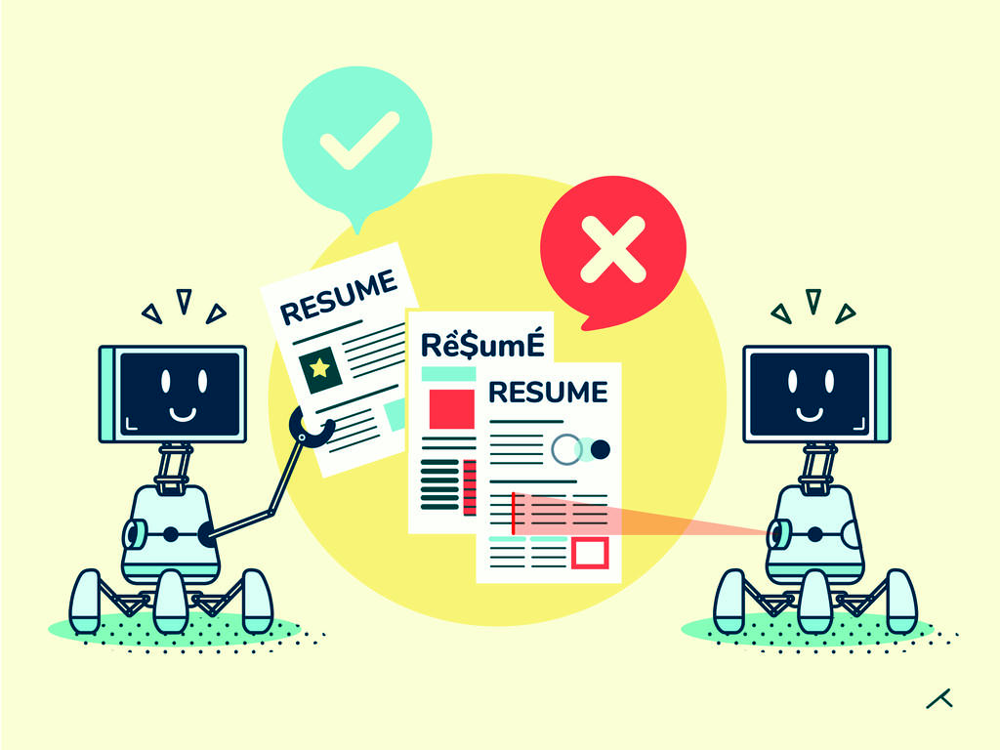

# Resume Screening

This repository contains a machine learning project focused on automating the resume screening process using Python. The primary goal is to develop a model that can efficiently and accurately evaluate resumes based on predefined criteria.



## Table of Contents

- [Why do we need Resume Screening?](#why-do-we-need-resume-screening)
- [Introduction](#introduction)
- [Modules & Libraries](#modules--libraries)
- [Functionality of Application](#functionality-of-application)
- [Tools & Technologies Used](#tools--technologies-used)
- [Tech Innovations in Resume Screening](#tech-innovations-in-resume-screening)
- [Installation](#installation)
- [Usage](#usage)
- [Dataset](#dataset)
- [Model](#model)
- [Results](#results)
- [Contributing](#contributing)
- [License](#license)
- [Contact](#contact)

## Why do we need Resume Screening?

- For each recruitment, companies take out the resume, referrals and go through them manually.
- Companies often received thousands of resumes for every job posting.
- When companies collect resumes then they categorize those resumes according to their requirements and then they send the collected resumes to the Hiring Teams.
- It becomes very difficult for the hiring teams to read the resume and select the resume according to the requirement, there is no problem if there are one or two resumes but it is very difficult in case of hundreds of resumes.
- To solve this problem, we will screen the resume using machine learning and NLP using Python so that we can complete days of work in few minutes.

## Introduction

- Resume screening is the process of determining whether a candidate is qualified for a role based on their education, experience, and other information captured on their resume.
- It’s a form of pattern matching between a job’s requirements and the qualifications of a candidate based on their resume.
- The goal of screening resumes is to decide whether to move a candidate forward – usually onto an interview – or to reject them.

## Modules & Libraries

### Modules
- **KNN**: It's a supervised technique used for classification. "K" in KNN represents the number of nearest neighbors used to classify or predict in case of continuous variables.
- **NLP**: Natural Language Processing (NLP) is a field in machine learning with the ability of a computer to understand, analyze, manipulate, and potentially generate human language.

### Libraries
- **NumPy**: Fundamental package for Python providing support for large multidimensional arrays and matrices.
- **Pandas**: Open-source library providing easy data structures and quicker data analysis for Python.
- **Matplotlib**: Open-source library widely used for creating publication-quality figures in a variety of formats.
- **Seaborn**: Library derived from Matplotlib used for visualizing statistical models like heat maps.
- **SciPy**: Open-source software used for scientific computing in Python.
- **Scikit-learn**: Free software machine learning library for Python used for classification, regression, clustering, and more.
- **NLTK**: Natural Language Toolkit (NLTK) is a set of processing libraries providing solutions for text analysis and language processing.

## Functionality of Application

Screening resumes usually involves a three-step process based on the role’s minimum and preferred qualifications. Both types of qualifications should be related to on-the-job performance. These qualifications can include:
- Work experience
- Education
- Skills and knowledge
- Personality traits
- Competencies

## Tools & Technologies Used

- Machine Learning and Artificial intelligence, along with text mining and natural language processing algorithms, can be applied for the development of programs (i.e. Applicant Tracking Systems) to automate the resume screening process.

## Tech Innovations in Resume Screening

- Designed to meet the needs of recruiters that current technology can’t solve, a new class of recruiting technology called AI for recruitment has arrived.
- AI for recruiting is an emerging category of HR technology designed to reduce — or even remove — time-consuming, administrative activities like manually screening resumes.
- The best AI software is designed to integrate seamlessly with your current recruiting stack so it doesn’t disrupt your workflow nor the candidate workflow.
- Industry experts predict this type of automation technology will transform the recruiting function.

## Installation

To get started with the project, clone the repository and install the required dependencies.

```bash
git clone https://github.com/anukalp-mishra/Resume-Screening.git
cd Resume-Screening
pip install -r requirements.txt
```
## Usage
Follow these steps to use the project:

Prepare your dataset of resumes.
Preprocess the data using the provided scripts.
Train the machine learning model.
Use the trained model to screen new resumes.
Detailed instructions for each step can be found in the Jupyter notebooks provided in the repository.

Dataset
The dataset used for this project consists of resumes collected from various sources. The data is preprocessed to extract relevant features such as skills, experience, and education.

Model
The project uses various machine learning models to evaluate resumes. These models are trained on labeled data to classify resumes based on predefined criteria. The models include:

Logistic Regression
Support Vector Machines
Random Forest
Neural Networks
Results
The performance of the models is evaluated using metrics such as accuracy, precision, recall, and F1-score. The results are documented and visualized in the Jupyter notebooks.

Contributing
Contributions are welcome! If you have suggestions for improvements or new features, feel free to open an issue or submit a pull request.

License
This project is licensed under the MIT License. See the LICENSE file for more details.

Contact
For any questions or inquiries, please contact:

Anukalp Mishra

GitHub: anukalp-mishra
